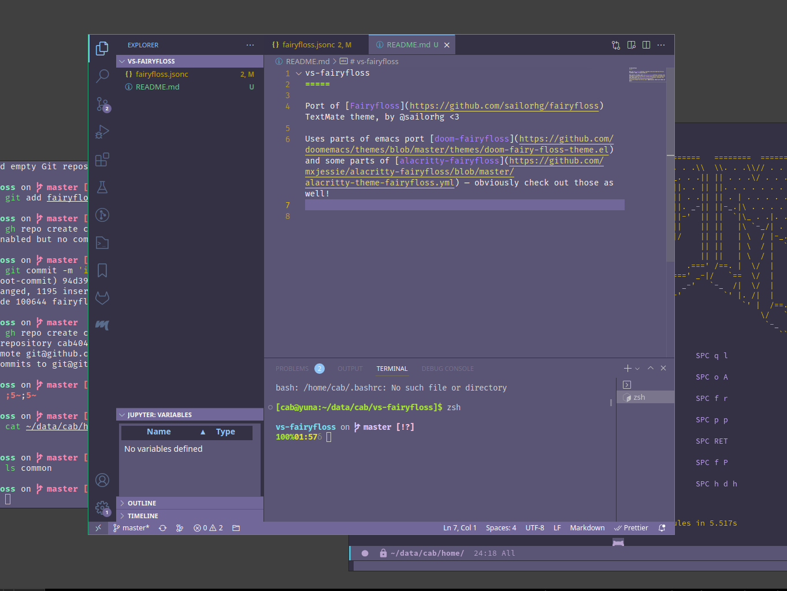

🌙💫☁️ vscode fairyfloss 🌟
=====

Port of [Fairyfloss](https://github.com/sailorhg/fairyfloss) TextMate theme, by @sailorhg <3

Uses parts of doom-emacs ff port [doom-fairyfloss](https://github.com/doomemacs/themes/blob/master/themes/doom-fairy-floss-theme.el) and some parts of [alacritty-fairyfloss](https://github.com/mxjessie/alacritty-fairyfloss/blob/master/alacritty-theme-fairyfloss.yml) — obviously check out those as well!

It retains some of the parts of VSCode Monokai, but I guess those will be slowly cut out.

